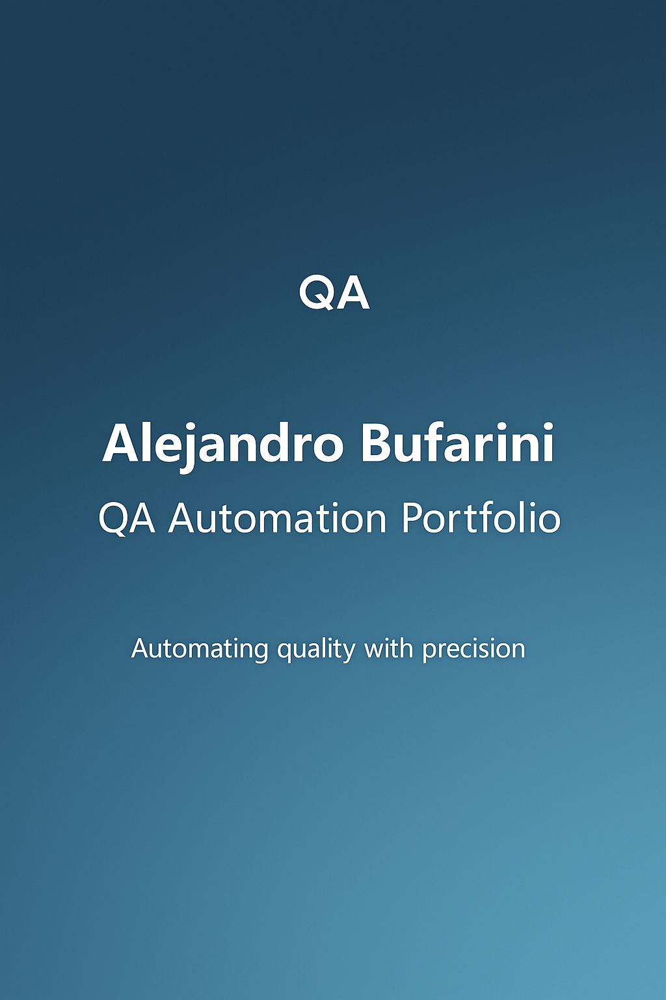

# Alejandro Bufarini — QA Automation Engineer (SDET)

👋 Hi! I'm Alejandro, a Senior QA Automation Engineer with over 10 years of experience designing scalable test automation frameworks for Web, API, and Performance testing.

---

## 🔧 Tech Stack

- **Languages**: Java, Kotlin, Python
- **Tools**: Selenium, RestAssured, K6, Serenity BDD, Cucumber, JUnit 5
- **CI/CD**: GitHub Actions, GitLab CI
- **Approaches**: BDD, TDD, Shift Left, SOLID

---

## 📌 Featured Projects

### 🚀 [API Test Automation Framework](https://github.com/bufaale/automation-api-java-serenity)
> Data-driven API testing with full BDD support, advanced JSON validation, SQL integration, and GitHub Actions CI pipeline.

### 🧪 [UI Web Automation Framework](https://github.com/bufaale/automation-web-java-maven)
> UI automation with Selenium WebDriver, PageObjects, parallel execution, clean architecture, and full CI/CD setup.

---

## 🌐 Online Portfolio

👉 [View Portfolio Site](https://bufaale.github.io/qa-sdet-portfolio)

---

## 📫 Let's connect!

- 💼 [LinkedIn](https://www.linkedin.com/in/alejandro-bufarini-113060129)
- 📧 alejandroebufarini@gmail.com

---

> 💬 This repository is part of my professional portfolio as an SDET. Feel free to explore, fork, or reach out!
